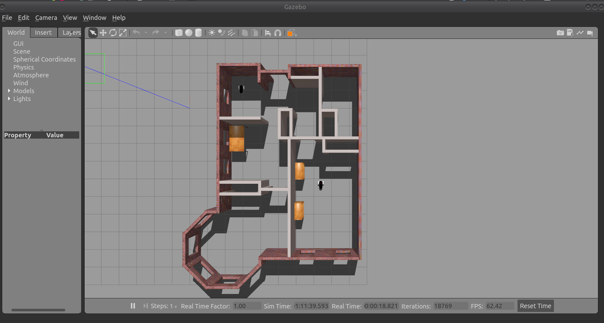

# RSDBuildMyWorld

This repo is my submission to Udacity's Robotic Software Developer Project 001, entitled "Build My World". It's an introduction into the world of modeling for the Gazebo physics/robotics simulator by using the built-in building editor to create an environment for future robotics projects.

Our simulated environment was to follow the following guidelines:
  * Must be a single-floor structure, built using the 'Building Editor' tool in Gazebo, applying at least one feature, one color, and optionally one texture.
  * Must contain at least one model of our choice, modeled using Gazebo's 'Model Editor' tool and the aforementioned model must be connected via joints.
  * Import our structure and model into an empty Gazebo world.
  * Import at least one model from Gazebo online library
  * Write a C++ World Plugin to display "Welcome to 's World!", within the terminal, upon launching the world file.

